# 实验三：HTTP正向代理实验

## 实验目的

- 网关安装`tinyproxy`
- 用主机设置浏览器代理指向`tinyproxy`建立的HTTP正向代理
- 在Kali中用`wireshark`抓包
- 分析抓包过程，理解HTTP正向代理HTTPS流量的特点（kali自带wireshark）

## 实验步骤

**1.准备实验所需拓扑结构并验证连通性**

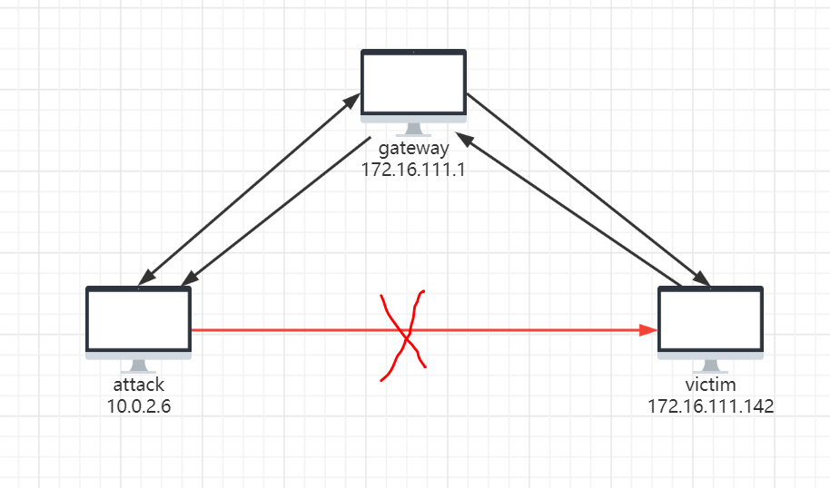

- 攻击者可以ping通网关，不能ping通靶机，可以上网

  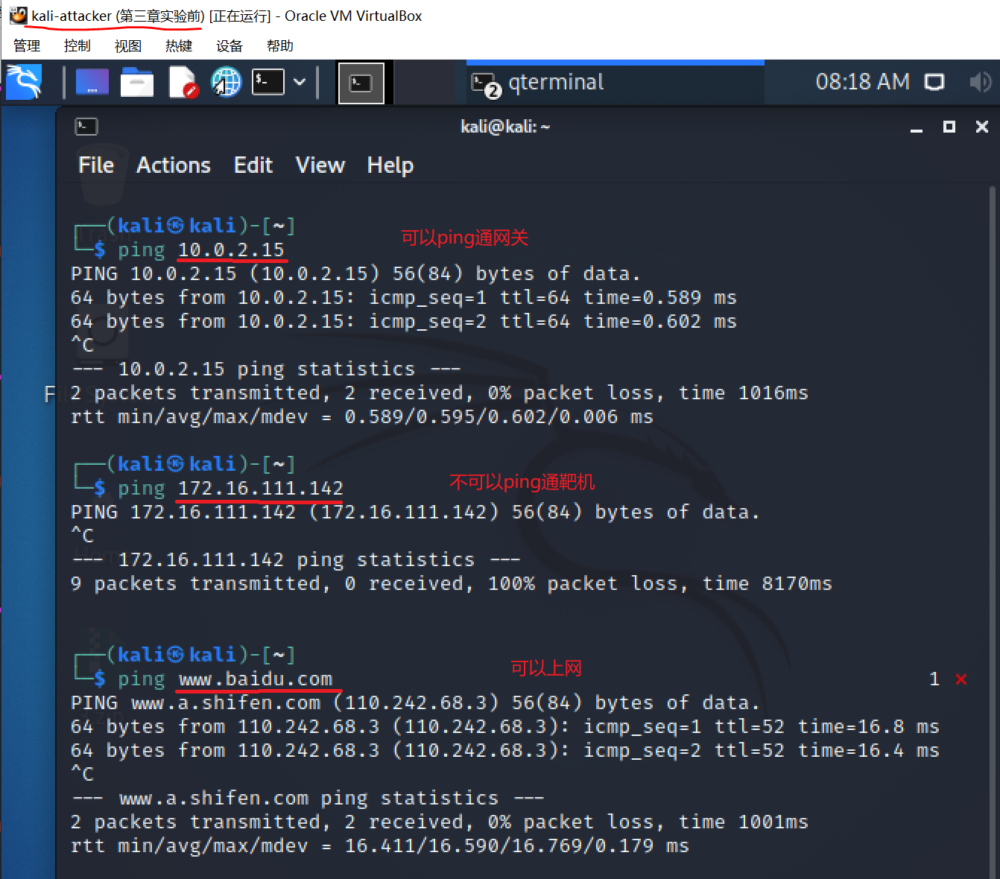

- 网关可以ping通攻击者，可以ping通靶机，可以上网

  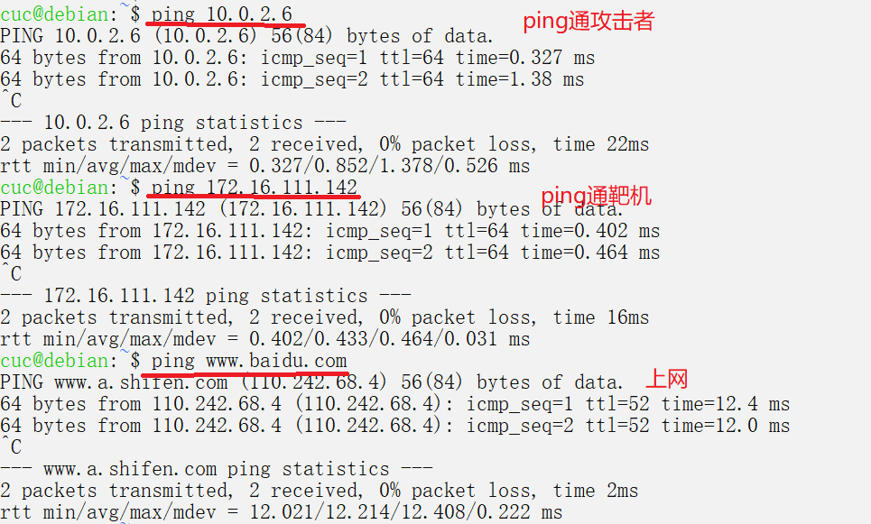

- 靶机可以ping通攻击者，可以ping通网关，可以上网

  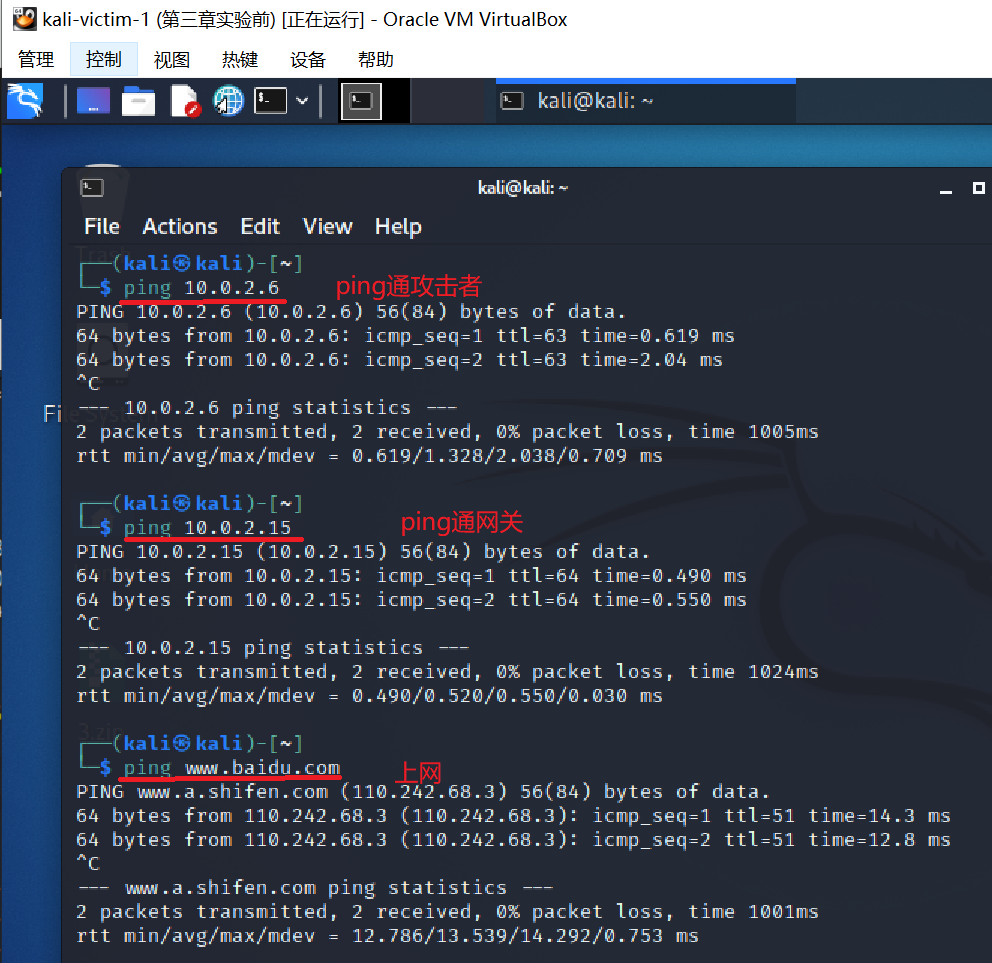

- 攻击者无法直接ping通靶机，可以设置网关作为代理来对靶机进行访问

**2.在网关配置tinyproxy**

- 网关上下载tinyproxy，并进行配置，之后开启tinyproxy服务

```cmd
apt-get update & apt-get install tinyproxy
# 备份tinyproxy配置文件
cp /etc/tinyproxy/tinyproxy.conf /etc/tinyproxy/tinyproxy.conf.bak
# 编辑tinyproxy配置文件
vim /etc/tinyproxy/tinyproxy.conf
# 开启tinyproxy服务
systemctl restart tinyproxy
# 如果后面再次修改了tinyproxy的配置文件，记得需要重启tinyproxy服务
systemctl restart tinyproxy.service
#查看tinyproxy服务状态
systemctl status tinyproxy.service
```

- 允许该网段使用本机（网关）作为代理服务器

  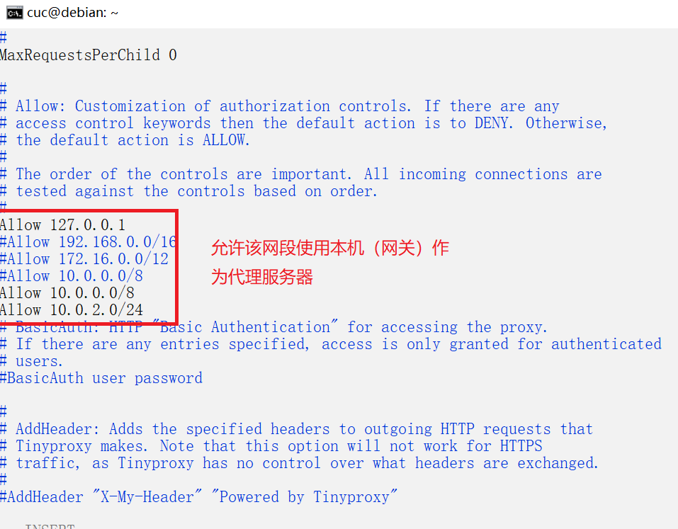

**3.在攻击者主机的浏览器中配置代理服务**

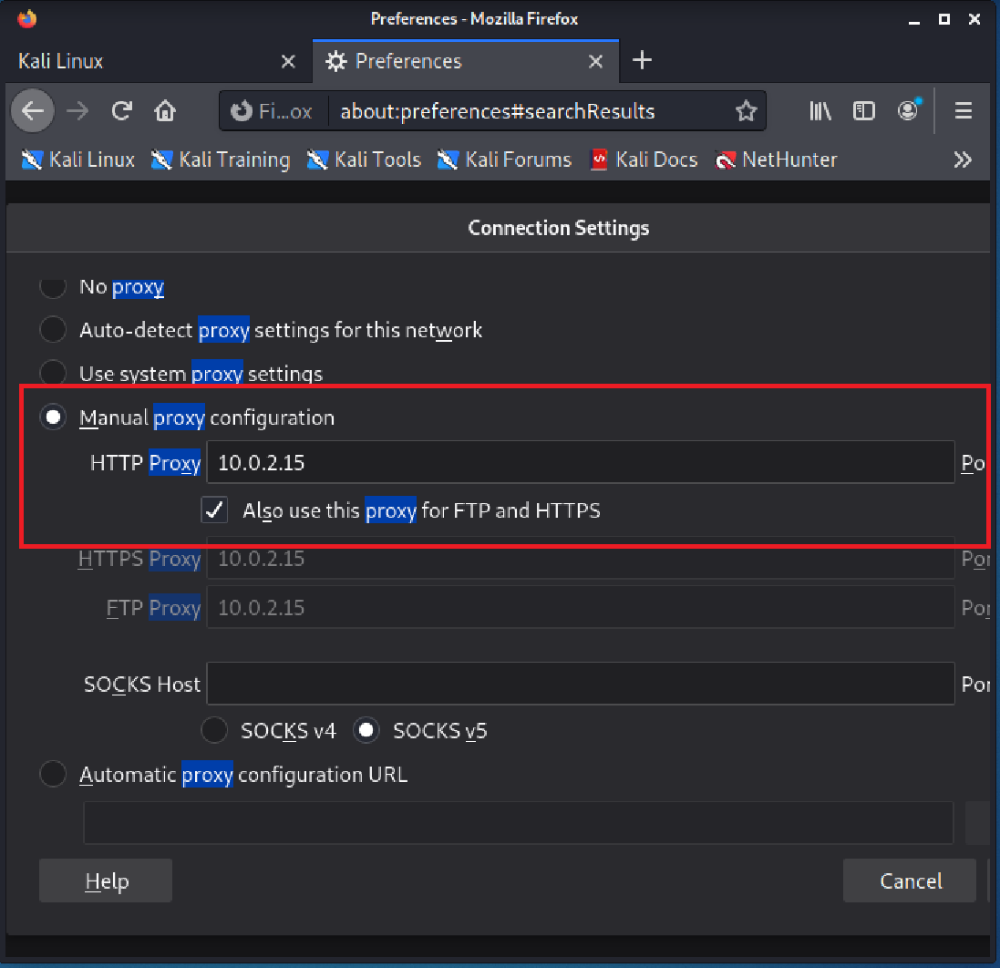

**4.在靶机上开启web服务**

```cmd
cd /var/www/html
sudo touch server.php
sudo vim server.php
# vim内容
<?php
var_dump($_SERVER);
# 编辑结束
php -S 0.0.0.0:8080
```

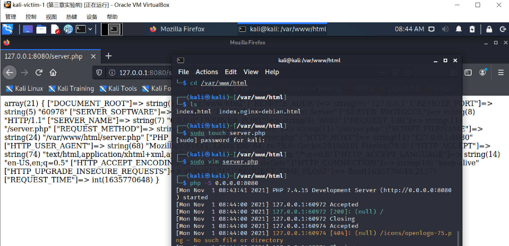

**5.使用tinyproxy访问靶机**

- 在攻击者的firefox上配置并启用代理服务器后，同时在攻击者、网关、靶机开启抓包：

**①攻击者主机**

- 使用firefox访问靶机127.16.111.142:8080，显示Apache默认界面，没有直接给出代理服务器信息

  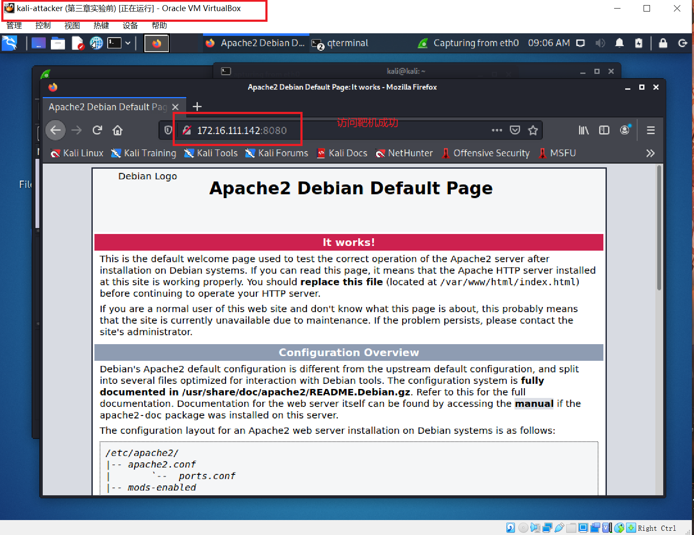

- wireshark抓包分析，过滤掉不必要的信息后，可以发现HTTP响应里含有`Via: 1.1 tinyproxy (tinyproxy/1.10.0)`字段

  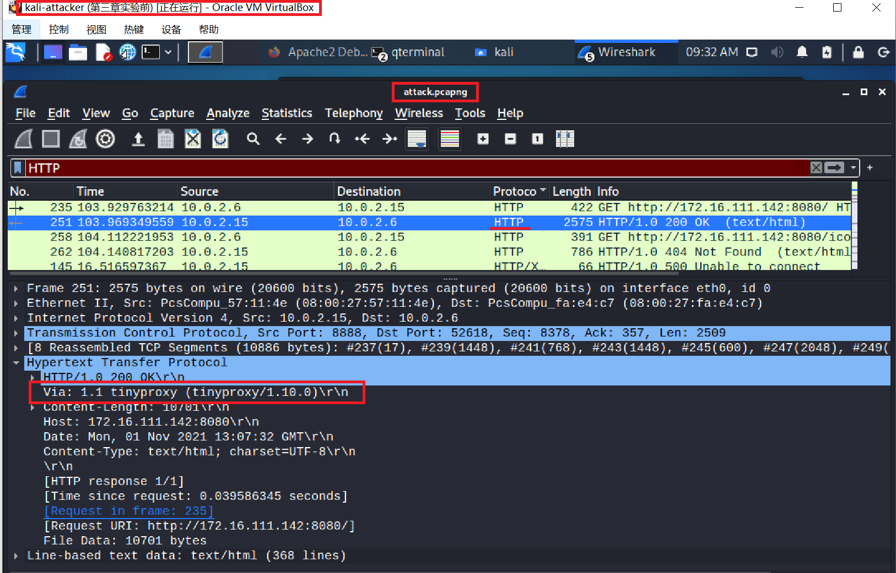

**②网关**

- wireshark抓包分析，发现HTTP响应里含有Via: 1.1 tinyproxy (tinyproxy/1.10.0)字段

  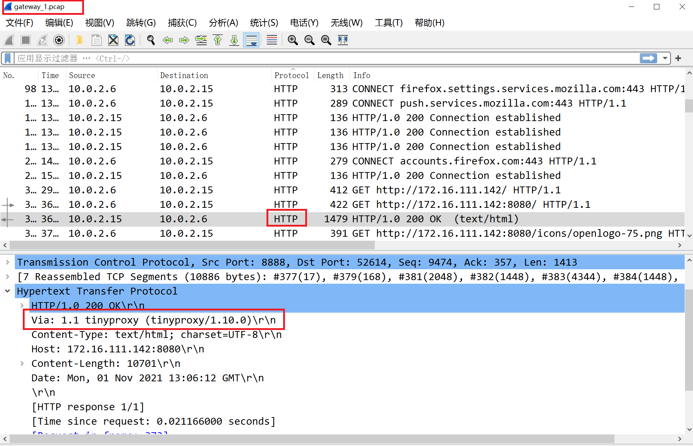

- 如果在网关设置防火墙规则过滤攻击者主机发出的请求，则攻击者主机依然无法访问靶机端的HTTP服务
- 网关可以将HTTP GET请求内容，若攻击者主机的浏览器不清除历史记录，则下次访问相同的HTTP服务时用非常短
- 代理层可以理解HTTP报文

**③靶机**

- 使用wireshark进行抓包分析，发现HTTP响应里含有Via: 1.1 tinyproxy (tinyproxy/1.10.0)字段

  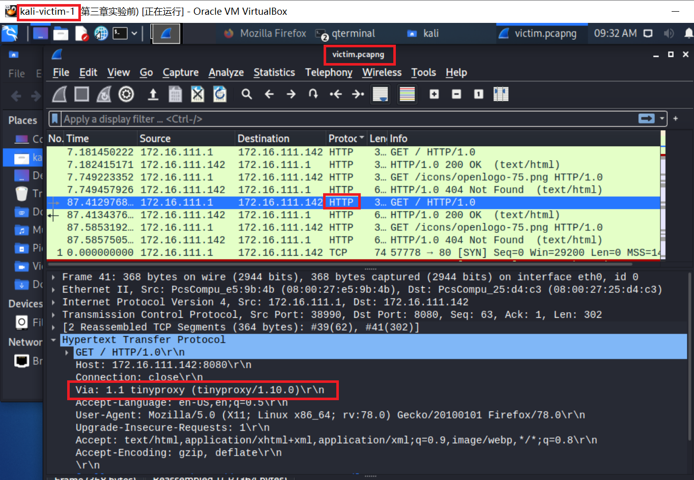

- 在HTTP协议中可以看到出现Via: 1.1 tinyproxy (tinyproxy/1.10.0)字段，说明此时网关（即代理服务器）正在提供代理服务
- 只能看到使用了代理服务，攻击者主机IP地址，以太网接口均未暴露

**④在攻击者主机上访问https页面**

- 在攻击者主机上用firefox访问https://www.baidu.com，同时在网关上进行抓包

  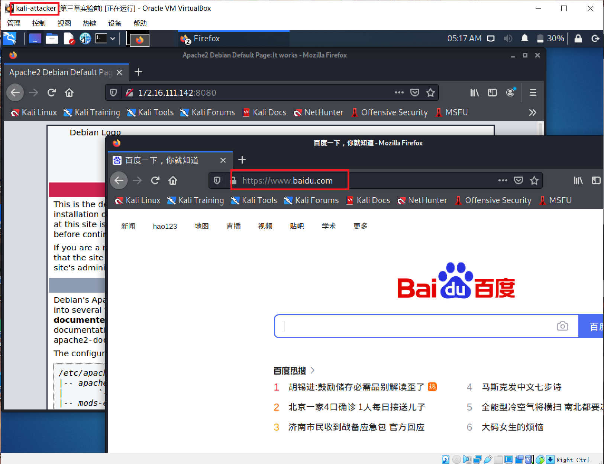

- 使用https，在网关处（即代理服务器）能看到用户访问的网址，但是传输的数据被加密了。

  - wireshark分析抓到的数据包可知，在TLS协议前还有一个和代理服务器建立连接的的过程，经过密钥交换和密钥协商后，用户和目标网站的通信都进行了加密。 

    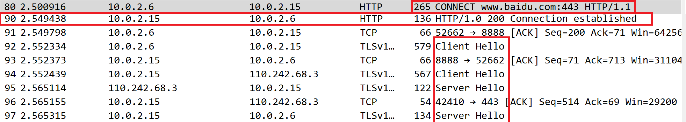

    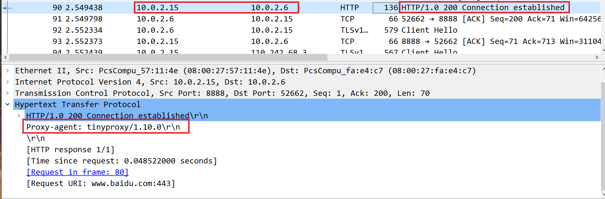

    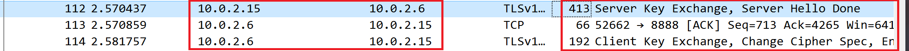

    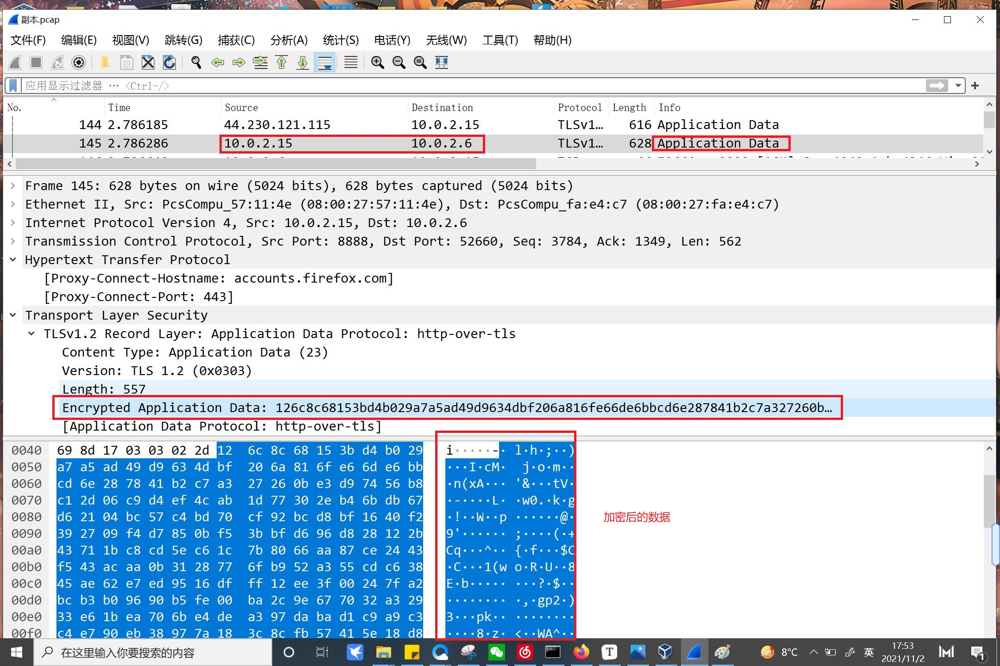

## 实验小结

- 可以利用代理服务器绕过某些访问限制（通过该实验可以看到，攻击者本身不能访问靶机，但是通过代理服务器却可以绕过该访问限制，达到访问靶机的目的）
- 代理服务器可以看到用户在访问什么网址
- 代理服务器没法看到https通信数据，很容易遭受中间人攻击

## 代理服务在网络攻防中的意义

- **对于攻击者的意义：**攻击者可以通过代理访问之前无法访问的机器，而被攻击者却无法判断攻击者的身份
- **对于被攻击者的意义：**攻击者同样也无法辩认被攻击者的身份，难以确定攻击对象

## 参考文献

- [第三章实验指南](https://c4pr1c3.github.io/cuc-ns/chap0x03/exp.html)
- [Tinyproxy](https://tinyproxy.github.io/)
- [CUCCS/2018-NS-Public-jckling](https://github.com/CUCCS/2018-NS-Public-jckling/blob/master/ns-0x03/3.md)

