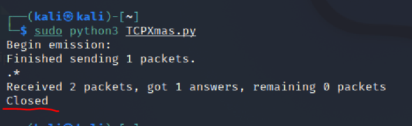

# 第五章：基于Scapy编写端口扫描器

## 实验目的

- 掌握网络扫描之端口状态探测的基本原理

## 实验环境

- python
- scapy
- nmap

## 网络拓扑结构


| 身份       | 虚拟机名称      | 网卡    | IP地址         |
| ---------- | --------------- | ------- | -------------- |
| 网关       | Debian-gateway  | intnet1 | 172.16.111.1   |
| 攻击者主机 | Kali-attacker-1 | intnet1 | 172.16.111.103 |
| 目标靶机   | Kali-victim-1   | intnet1 | 172.16.111.142 |

## 实验要求

- [x] 完成以下扫描任务的编程实现
	- TCP connect scan / TCP stealth scan
	- TCP Xmas scan / TCP fin scan / TCP null scan
	- UDP scan

- [x] 上述每种扫描技术的实现测试均需要测试端口状态为：`开放`、`关闭`和`过滤`状态时的程序执行结果
- [x] 提供每一次扫描测试的抓包结果并分析与课本中的扫描方法原理是否相符？如果不同，试分析原因
- [x] 在实验报告中详细说明实验网络环境拓扑、被测试 IP 的端口状态是如何模拟的
- [x]  （可选）复刻`nmap`的上述扫描技术实现的命令行参数开关

## 实验基础

### 端口状态：

- **开放：**
  - 应用/服务监听该端口
  - **有条件有规则**地响应请求数据报文

- **关闭：**
  - 无应用/服务监听该端口
  - **有条件有规则**地响应或忽略请求数据报文
  - 操作系统会针对SYN请求报文回应RST报文

- **被过滤：**
  - 报文过滤程序监听该端口
  - **有条件有规则**地响应或忽略请求数据报文
    - 报文过滤程序可能会返回报文拒绝消息

### 端口状态模拟

- 关闭状态

```shell
sudo ufw disable
systemctl stop apache2
systemctl stop dnsmasq # 关闭端口
```

- 开放状态

```shell
systemctl start apache2 # 开启服务开放TCP端口
systemctl start dnsmasq # 开启服务开放UDP端口
```

- 被过滤状态

```
sudo ufw enable && sudo ufw deny 80/tcp
sudo ufw enable && sudo ufw deny 53/udp
```

### Scapy基础

```python
# 导入模块
from scapy.all import *
# 查看包信息
pkt = IP(dst="")
ls(pkt) # 查看包
pkt.show() # 显示包
summary(pkt)
# 发送数据包
send(pkt)  # 发送第三层数据包，但不会受到返回的结果。
sr(pkt)  # 发送第三层数据包，返回两个结果，分别是接收到响应的数据包和未收到响应的数据包。
sr1(pkt)  # 发送第三层数据包，仅仅返回接收到响应的数据包。
sendp(pkt)  # 发送第二层数据包。
srp(pkt)  # 发送第二层数据包，并等待响应。
srp1(pkt)  # 发送第二层数据包，并返回响应的数据包，只接收1个包
ret[ICMP].type # 访问数据包
ret[IP] # 访问数据包
# 监听网卡
sniff(iface="wlan1",count=100,filter="tcp")
# 应用：简单的SYN端口扫描 （测试中）
pkt = IP("...")/TCP(dport=[n for n in range(22, 3389)], flags="S")
ans, uans = sr(pkt)
ans.summary() # flag为SA表示开放，RA表示关闭
pkts=sniff(iface='eth0',count=100) # 进行抓包，指定100个数据包
pkts[99][IP] # 查了第99个包的数据
pkts[99][Padding] # 查看padding信息
pkts[99][TCP].flag # 查看标志位
pkts=rcap('') # 查看抓的包的结果
help(wrpcap) # 保存抓包结果
```

### 扫描

- `TCP connect scan`与`TCP stealth scan`都是先发送一个`S`，然后等待回应。如果有回应且标识为`RA`，说明目标端口处于关闭状态；如果有回应且标识为`SA`，说明目标端口处于开放状态。这时：
  - `TCP connect scan`会回复一个RA，在完成三次握手的同时断开连接
  - `TCP stealth scan`只回复一个R，不完成三次握手，直接取消建立连接
- `TCP Xmas scan、TCP fin scan`及`TCP null scan`不涉及三次交互。它们都是先发送一个包，然后根据目标主机是否回复`R`来目标端口的状态。不同的是：
  - TCP Xmas scan发送的是`FPU`
  - TCP fin scan发送的是`F`
  - TCP null scan发送的包里没有设置任何flag
- `UDP`是无连接的协议，通过发送`UDP+port`得到的回复确定被扫描主机的状态。
  - Open：`no response / server responds to the client with a UDP packet`；
  - Closed：`ICMP error type 3 and code 3`
  - Filtered：`no response / ICMP error type 3 and code 1,2,3,9,10,13`。


## 实验过程

### TCP connect scan

- 预想的实验结果：若攻击者向靶机发送SYN包，能完成三次握手，收到ACK，则端口为开发状态；若只收到一个RST包，则端口为关闭状态；倘若什么都没收到，即为端口过滤状态。

```python
# TCPconnect.py
from scapy.all import *
def tcpconnect(dst_ip,dst_port,timeout=10):
    pkts=sr1(IP(dst=dst_ip)/TCP(dport=dst_port,flags="S"),timeout=timeout)# 构造SYN包，flags='S'表示为SYN包
    if (pkts is None):
        print("FILTER")
    elif(pkts.haslayer(TCP)):
        if(pkts[1].flags=='AS'): # 收到的第一个包为回来的tcp包，若为ACK包，则表示处于开放状态
            print("OPEN")
        elif(pkts[1].flags=='AR'): # 若收到的第一个包为RST包，则表示为开放状态
                print("CLOSE")
tcpconnect('172.16.111.142',80)
```

- Closed

  靶机检测自身端口状态

  

	攻击者主机运行`Tcpconnect.py`脚本
	
	
	
	靶机Wireshark抓包
	
	
	
	- TCP三次握手机制，攻击者主机向靶机发送连接请求后，靶机相应端口处于关闭状态，靶机将会向攻击者返回[RST,ACK]包，抓包结果与预期结果一致。

- Open

  靶机开放80端口

  `sudo systemctl start apache2`开启apache2服务从而开放80端口

  攻击者主机运行`Tcpconnect.py`脚本

  

  靶机Wireshark抓包

  

  - TCP三次握手机制，攻击者主机向靶机发送连接请求后，靶机相应端口处于开启状态，收到靶机返回[SYN/ACK]数据包，抓包结果与预期结果一致。

- Filtered

  靶机添加规则过滤80端口

  `sudo ufw enable && sudo ufw deny 80/tcp`

  

  攻击者主机运行`Tcpconnect.py`脚本

  

  靶机Wireshark抓包

  

  - TCP三次握手机制，攻击者主机向靶机发送连接请求后，靶机相应端口处于过滤状态，没有得到任何响应，抓包结果与预期结果一致。

- 攻击者主机`nmap`复刻

  `sudo nmap -sT -p 80 172.16.111.142`

  - Closed

    

  - Open

    

  - Filtered

    

### TCP stealth scan

```python
#攻击者主机编写tcpstealth.py
from scapy.all import *
def tcpstealthscan(dst_ip , dst_port , timeout = 10):
    pkts = sr1(IP(dst=dst_ip)/TCP(dport=dst_port,flags="S"),timeout=10) # 构造SYN包
    if (pkts is None):
        print ("Filtered")
    elif(pkts.haslayer(TCP)):
        if(pkts.getlayer(TCP).flags == 0x12):
            send_rst = sr(IP(dst=dst_ip)/TCP(dport=dst_port,flags="R"),timeout=10)
            print ("Open")
        elif (pkts.getlayer(TCP).flags == 0x14):
            print ("Closed")
        elif(pkts.haslayer(ICMP)):
            if(int(pkts.getlayer(ICMP).type)==3 and int(stealth_scan_resp.getlayer(ICMP).code) in [1,2,3,9,10,13]):
                print ("Filtered")
tcpstealthscan('172.16.111.142',80)
```

- Closed

  攻击者主机运行`Tcpstealth.py`脚本

  

  靶机Wireshark抓包

  

- Open

  攻击者主机运行`Tcpstealth.py`脚本

  

  靶机Wireshark抓包

  

- Filtered

  攻击者主机运行`Tcpstealth.py`脚本

  

  靶机Wireshark抓包

  

- 攻击者主机`nmap`复刻

  `sudo nmap -sS -p 80 172.16.111.142`

  - Closed

    

  - Open

    

  - Filtered

    

### TCP Xmas scan

- 预想的实验结果：TCP Xmas scan是一种隐蔽性扫描，当端口处于关闭状态时，会回复一个RST包，其余所有状态都将不回复

```python
#攻击者主机编写tcpxmas.py
from scapy.all import *
def Xmasscan(dst_ip , dst_port , timeout = 10):
    pkts = sr1(IP(dst=dst_ip)/TCP(dport=dst_port,flags="FPU"),timeout=10)# 发送FIN,PUSH,URG
    if (pkts is None): # 未收到任何包可能为这两种状态
        print ("Open|Filtered")
    elif(pkts.haslayer(TCP)):
        if(pkts.getlayer(TCP).flags == 0x14):
            print ("Closed") # 收到RST包即为端口关闭状态
    elif(pkts.haslayer(ICMP)):
        if(int(pkts.getlayer(ICMP).type)==3 and int(pkts.getlayer(ICMP).code) in [1,2,3,9,10,13]):
            print ("Filtered")
Xmasscan('172.16.111.142',80)
```

- Closed

  攻击者主机运行`TcpXmas.py`脚本

  

  靶机Wireshark抓包

  

  - Xmas发送TCP请求，在靶机端口关闭状态下，靶机响应[RST，ACK]，抓包结果与预期结果一致。

- Open

  攻击者主机运行`TcpXmas.py`脚本

  

  靶机Wireshark抓包

  

  - Xmas发送TCP请求，在靶机端口开放状态下，靶机无响应，抓包结果与预期结果一致。

- Filtered

  攻击者主机运行`TcpXmas.py`脚本

  

  靶机Wireshark抓包

  

  - Xmas发送TCP请求，在靶机端口被过滤状态下，靶机无响应，抓包结果与预期结果一致。

- 攻击者主机`nmap`复刻

  `sudo nmap -sX -p 80 172.16.111.142`

  - Close

    

  - Open

    

  - Filtered

    

### TCP fin scan

- 预想的实验结果：仅发送FIN包，FIN数据包能够通过只监测SYN包的包过滤器，隐蔽性较SYN扫描更⾼，此扫描与Xmas扫描也较为相似，只是发送的包为FIN包，同理，收到RST包说明端口处于关闭状态；反之说明为开启/过滤状态。

```python
#攻击者主机编写TCPfin.py
from scapy.all import *
def fin_scan(dst_ip , dst_port , timeout = 10):
    pkts = sr1(IP(dst=dst_ip)/TCP(dport=dst_port,flags="F"),timeout=10)#发送FIN包
    if (pkts is None):#未收到任何包可能为这两种状态
        print ("Open|Filtered")
    elif(pkts.haslayer(TCP)):
        if(pkts.getlayer(TCP).flags == 0x14):
            print ("Closed")#收到RST包即为端口关闭状态
    elif(pkts.haslayer(ICMP)):
        if(int(pkts.getlayer(ICMP).type)==3 and int(pkts.getlayer(ICMP).code) in [1,2,3,9,10,13]):
            print ("Filtered")
fin_scan('172.16.111.14',80)
```

- Closed

  攻击者主机运行`TCPfin.py`脚本

  

  靶机Wireshark抓包

  

- Open

  攻击者主机运行`TCPfin.py`脚本

  

  靶机Wireshark抓包

  

- Filtered

  攻击者主机运行`TCPfin.py`脚本

  

  靶机Wireshark抓包

  ![]img/vic-tcpf-wireshark-filter.PNG)

- 攻击者主机`nmap`复刻

  `sudo nmap -sF -p 80 172.16.111.142`

  - Closed

    

  - Open

    

  - Filtered

    

### TCP null scan

- 预想的实验结果：发送的包中关闭所有TCP报⽂头标记，实验结果预期还是同理：收到RST包说明端口为关闭状态，未收到包即为开启/过滤状态

```python
#攻击者主机编写TCPnull.py
from scapy.all import *
def nullscan(dst_ip , dst_port , timeout = 10):
    pkts = sr1(IP(dst=dst_ip)/TCP(dport=dst_port,flags=""),timeout=10)
    if (pkts is None): # 未收到任何包可能为这两种状态
        print ("Open|Filtered")
    elif(pkts.haslayer(TCP)):
        if(pkts.getlayer(TCP).flags == 0x14):
            print ("Closed") # 收到RST包即为端口关闭状态
    elif(pkts.haslayer(ICMP)):
        if(int(pkts.getlayer(ICMP).type)==3 and int(pkts.getlayer(ICMP).code) in [1,2,3,9,10,13]):
            print ("Filtered")
nullscan('172.16.111.142',80)
```

- Closed

  攻击者主机运行`TCPnull.py`脚本

  

  靶机Wireshark抓包

  

- Open

  攻击者主机运行`TCPnull.py`脚本

  

  靶机Wireshark抓包

  

- Filtered

  攻击者主机运行`TCPnull.py`脚本

  

  靶机Wireshark抓包

  

- 攻击者主机`nmap`复刻

  `sudo nmap -sN -p 80 172.16.111.142`

  - Closed

    

  - Open

    

  - Filtered

    

### UDP scan

- 预想的实验结果：UDP是一种无连接的传输协议，它不保证数据包一定到达目的地。当攻击者收到来自靶机的UDP响应包时，说明端口处于开启状态，但同时如果没有得到响应，端口也可能处于开启或过滤状态；如果收到ICMP端口不可达错误，说明端口关闭；如果是其他ICMP错误，说明端口处于过滤状态。

```python
#攻击者主机编写UDP.py
from scapy.all import *
def udpscan(dst_ip,dst_port,dst_timeout = 10):
    # 发送UDP包
    resp = sr1(IP(dst=dst_ip)/UDP(dport=dst_port),timeout=dst_timeout)
    # 未收到UDP回复即为open/filter
    if (resp is None):
        print("Open|Filtered")
    # 收到UDP回复则为开启状态
    elif (resp.haslayer(UDP)):
        print("Open")
    elif(resp.haslayer(ICMP)):
        #the server responds with an ICMP port unreachable error type 3 and code 3, meaning that the port is closed on the server.
        if(int(resp.getlayer(ICMP).type)==3 and int(resp.getlayer(ICMP).code)==3):
            print("Closed")
         #If the server responds to the client with an ICMP error type 3 and code 1, 2, 9, 10, or 13, then that port on the server is filtered.
        elif(int(resp.getlayer(ICMP).type)==3 and int(resp.getlayer(ICMP).code) in [1,2,9,10,13]):
            print("Filtered")
        elif(resp.haslayer(IP) and resp.getlayer(IP).proto==IP_PROTOS.udp):
            print("Open")
udpscan('172.16.111.142',53)
```

- Closed

  攻击者主机运行`UDP.py`脚本

  

  靶机Wireshark抓包

  

  - UDP扫描属于开放式扫描，靶机udp/53 端口关闭状态下，对攻击者主机并无任何响应，可以看到抓到的ICMP包type/code为3，且确实没有收到UDP回复包，抓包结果与预期结果一致。

- Open

  攻击者主机运行`UDP.py`脚本

  

  靶机Wireshark抓包

  

  - UDP扫描属于开放式扫描，靶机udp/53 端口开启状态下，对攻击者主机并无任何响应，无法判断被过滤或开启，抓包结果与预期结果一致。

- Filtered

  攻击者主机运行`UDP.py`脚本

  

  靶机Wireshark抓包

  

  - UDP扫描属于开放式扫描，靶机udp/53 端口被过滤状态下，对攻击者主机并无任何响应，无法判断被过滤或开启，抓包结果与预期结果一致。

- 攻击者主机`nmap`复刻

  `sudo nmap -sU -p 53 172.16.111.142`

  - Closed

    

  - Open

    

  - Filtered

    

## 实验总结

1. 提供每一次扫描测试的抓包结果并分析与课本中的扫描方法原理是否相符？如果不同，试分析原因

   答：相符

2. 各种扫描方式对应的状态

| 扫描方式/端口状态         | 开启                            | 关闭                            | 过滤            |
| ------------------------- | ------------------------------- | ------------------------------- | --------------- |
| TCP connect/TCP stealth   | 完整的三次握手，能抓到ACK&RST包 | 完整的三次握手，能抓到ACK&RST包 | 收不到任何TCP包 |
| TCP Xmas/TCP FIN/TCP NULL | 收不到TCP回复包                 | 收到一个RST包                   | 收不到TCP回复包 |
| UDP                       | 收到UDP回复包                   | 收不到UDP回复包                 | 收不到UDP回复包 |

## 参考资料

- [2020-ns-public-LyuLumos](https://github.com/CUCCS/2020-ns-public-LyuLumos/blob/ch0x05/ch0x05/README.md)
- [2020-ns-public-AlinaZxy](https://github.com/CUCCS/2020-ns-public-AlinaZxy/blob/chap05/chap05/chap05.md)
- [2019-NS-Public-chencwx](https://github.com/CUCCS/2019-NS-Public-chencwx/blob/ns_chap0x05/ns_chapter5/%E7%BD%91%E7%BB%9C%E6%89%AB%E6%8F%8F%E5%AE%9E%E9%AA%8C%E6%8A%A5%E5%91%8A.md)
- [scapy2.4.4文档](https://scapy.readthedocs.io/en/latest/)
- [nmap资料](https://nmap.org/book/synscan.html)

