# 实验九——入侵检测

## 实验目的

- 使用Snort进行入侵检测

## 实验环境

- Virtualbox
- Debian-gateway
- Kali-attack-intnet1
- Kali-victim-1

## 实验前期配置

### 拓扑结构

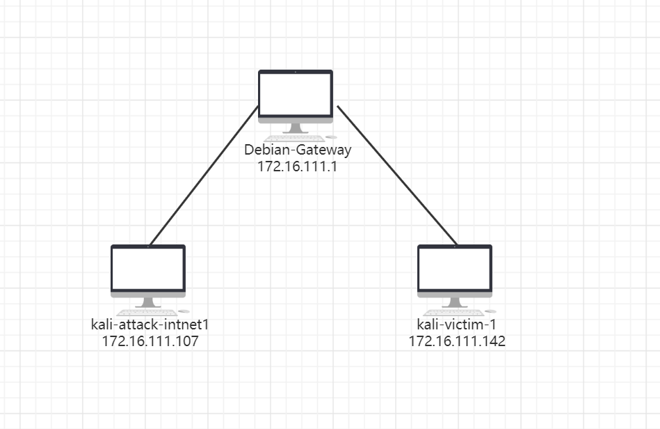

- Snort安装

```bash
# 禁止在apt安装时弹出交互式配置界面
export DEBIAN_FRONTEND=noninteractive

apt install snort
```

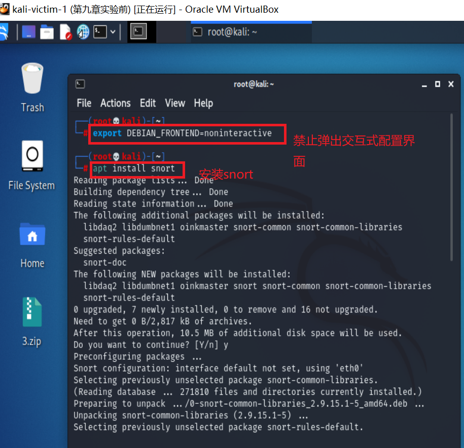

## 实验步骤

### 实验一：配置snort为嗅探模式

```bash
# 显示IP/TCP/UDP/ICMP头
snort –v
# 显示应用层数据
snort -vd

# 显示数据链路层报文头
snort -vde

# -b 参数表示报文存储格式为 tcpdump 格式文件
# -q 静默操作，不显示版本欢迎信息和初始化信息
snort -q -v -b -i eth0 "port not 22"
```

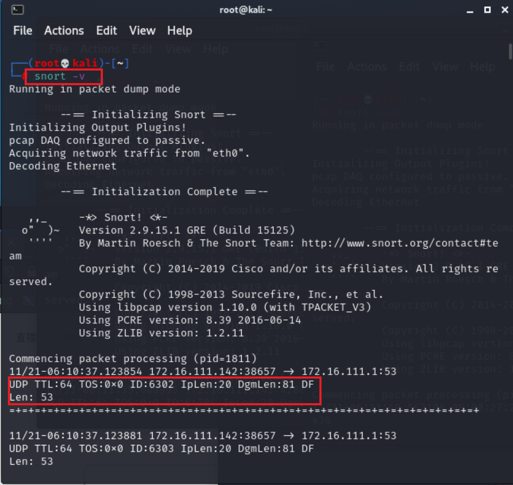

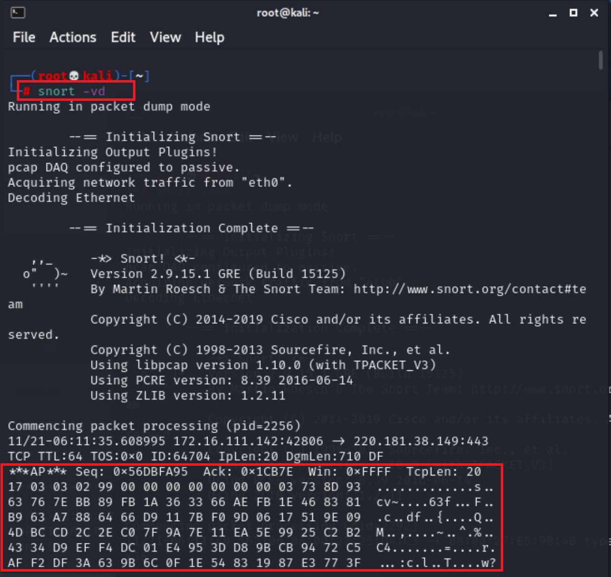

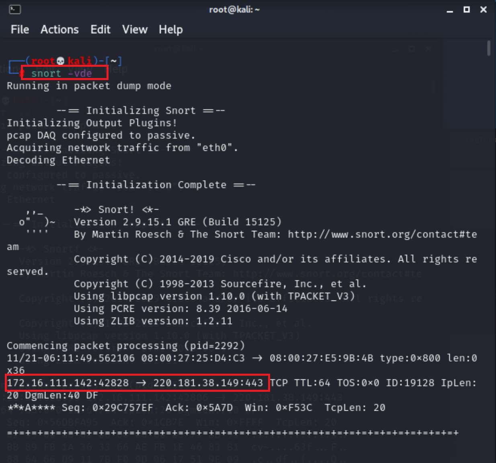

```bash
# 使用 CTRL-C 退出嗅探模式
# 嗅探到的数据包会保存在 /var/log/snort/snort.log.<epoch timestamp>
# 其中<epoch timestamp>为抓包开始时间的UNIX Epoch Time格式串
# 可以通过命令 date -d @<epoch timestamp> 转换时间为人类可读格式
# exampel: date -d @1511870195 转换时间为人类可读格式
# 上述命令用tshark等价实现如下：
tshark -i eth0 -f "port not 22" -w 1_tshark.pcap
```

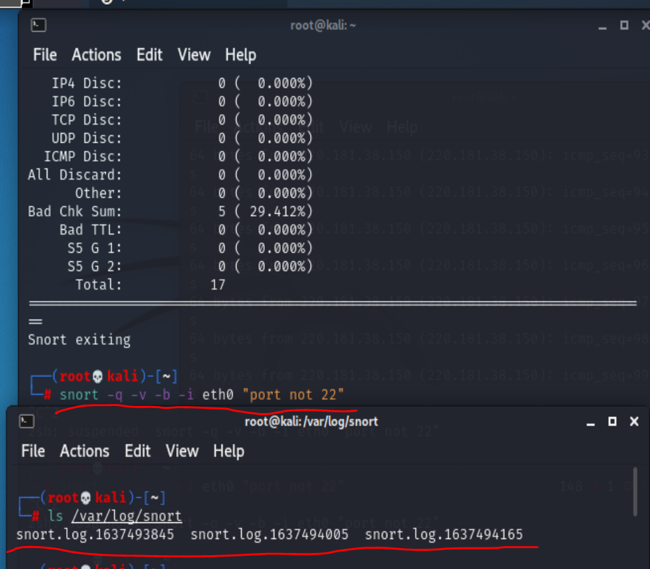

### 实验二：配置并启用snort内置规则

```bash
# /etc/snort/snort.conf 中的 HOME_NET 和 EXTERNAL_NET 需要正确定义
# 例如，学习实验目的，可以将上述两个变量值均设置为 any
snort -q -A console -b -i eth0 -c /etc/snort/snort.conf -l /var/log/snort/
```

- 首先查看`snort.conf`配置文件中的规则

  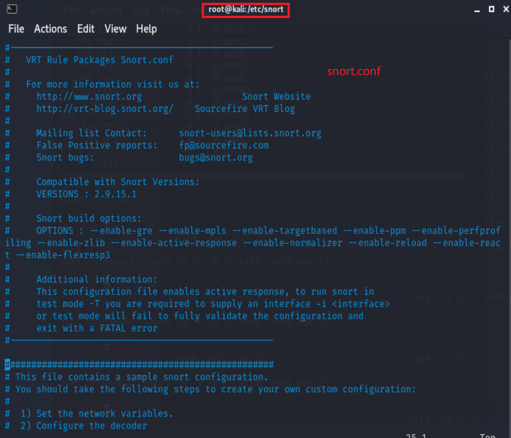

- 将`HOME_NET`和`EXTERNAL_NET`设置为any

  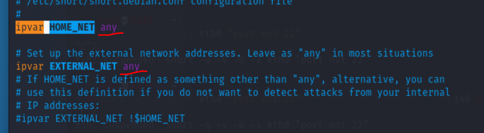

- 启用内置规则：`snort -q -A console -b -i eth0 -c /etc/snort/snort.conf -l /var/log/snort/`

  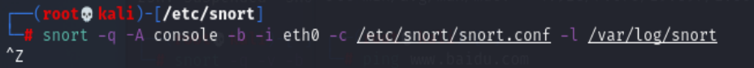


### 实验三：自定义snort规则

```bash
# 新建自定义 snort 规则文件
vim /etc/snort/rules/cnss.rules

# INSERT
alert tcp $EXTERNAL_NET any -> $HTTP_SERVERS 80 (msg:"Access Violation has been detected on /etc/passwd ";flags: A+; content:"/etc/passwd"; nocase;sid:1000001; rev:1;)
alert tcp $EXTERNAL_NET any -> $HTTP_SERVERS 80 (msg:"Possible too many connections toward my http server"; threshold:type threshold, track by_src, count 100, seconds 2; classtype:attempted-dos; sid:1000002; rev:1;)
```

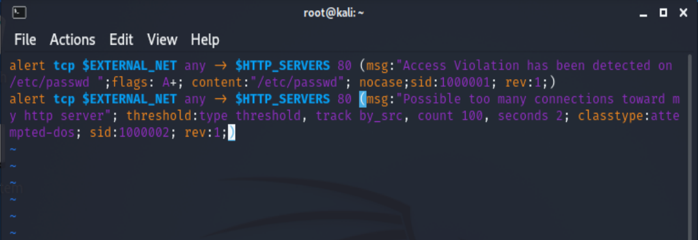

```bash
# 添加配置代码到 /etc/snort/snort.conf
include $RULE_PATH/cnss.rules
```


```bash
# 开启apache2
service apache2 start
# 应用规则开启嗅探
snort -q -A console -b -P 65535 -i eth0 -c /etc/snort/snort.conf

# 在attacker上使用ab命令进行压力测试
ab -c 100 -n 10000 http://172.16.111.142/haha
```

- 可以看到靶机发出了警报，可见配置生效了

  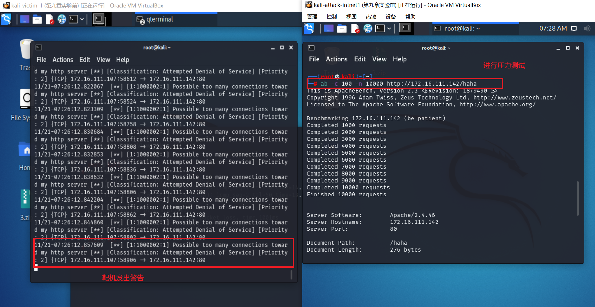

### 实验四：和防火墙联动

- 本实验需要用到的脚本代码 [Guardian-1.7.tar.gz](https://gitee.com/cloud_and_mist/ns-public-lyu-lumos/blob/ch0x09/ch0x09/attach/guardian.tar.gz) ，请下载后解压缩：

```bash
# 解压缩 Guardian-1.7.tar.gz
tar zxf guardian.tar.gz

# 安装 Guardian 的依赖 lib
apt install libperl4-corelibs-perl
```

- 编辑`guardian.conf `并保存，修改参数为

```bash
  HostIpAddr      172.16.111.142
  Interface       eth0
```

- 开启snort:`snort -q -A fast -b -i eth0 -c /etc/snort/snort.conf -l /var/log/snort/`

- 启动guardian:`perl guardian.pl -c guardian.conf`

- 在attack上用`nmap`暴力扫描victim：`nmap 172.16.111.142 -A -T4 -n -vv`

- guardian.conf 中默认的来源IP被屏蔽时间是 60 秒（屏蔽期间如果黑名单上的来源IP再次触发snort报警消息，则屏蔽时间会继续累加60秒）

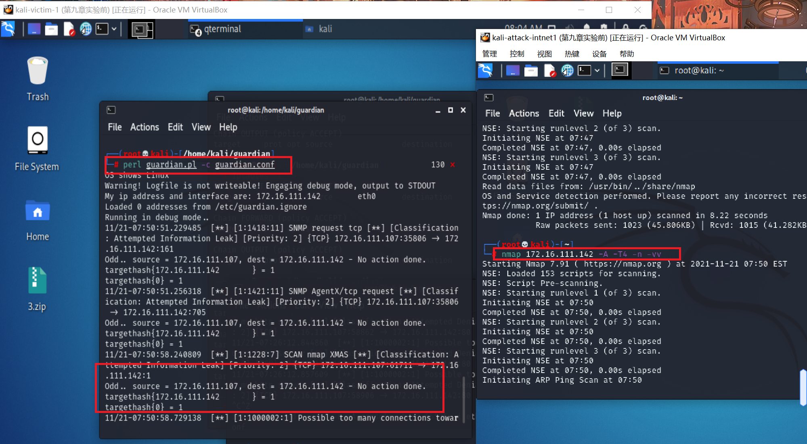

- 记录`Kali-Attacker`iptables的变化

```bash
(root💀kali)-[/home/kali_attacker/Desktop/guardian]
└─# iptables -L -n
Chain INPUT (policy ACCEPT)
target     prot opt source               destination
REJECT     tcp  --  172.16.111.107       0.0.0.0/0            reject-with tcp-reset
DROP       all  --  172.16.111.107       0.0.0.0/0

Chain FORWARD (policy ACCEPT)
target     prot opt source               destination

Chain OUTPUT (policy ACCEPT)
target     prot opt source               destination

# 1分钟后，guardian.pl 会删除刚才添加的2条 iptables 规则
(root💀kali)-[/home/kali_attacker/Desktop/guardian]
└─# iptables -L -n
Chain INPUT (policy ACCEPT)
target     prot opt source               destination

Chain FORWARD (policy ACCEPT)
target     prot opt source               destination

Chain OUTPUT (policy ACCEPT)
target     prot opt source               destination
```

## 实验思考题

#### IDS与防火墙的联动防御方式相比IPS方式防御存在哪些缺陷？是否存在相比较而言的优势？

- 入侵检测系统 IDS (Intrusion Detection Systems)：分析和监控网络流量，以查找表明攻击者正在使用已知网络威胁来渗透或窃取网络数据的标志。 IDS系统将当前网络活动与已知威胁数据库进行比较，以检测安全策略违规，恶意软件和端口扫描程序等多种行为。
- 入侵防御系统 IPS (Intrusion Prevention Systems) ：与防火墙位于网络的同一区域。 检查数据包的内容，主动阻止或阻止检测到的入侵。可以采取发送警报等措施，丢弃检测到的恶意数据包，重置连接或阻止来自违规IP地址的流量。还可以纠正循环冗余校验（CRC）错误，对数据包进行碎片整理，缓解TCP排序问题，并清理不需要的传输和网络层选项。
- IDS与防火墙的联动属于**被动防御**，它可以检测出不安全的网络行为，却不阻断网络行为
- IPS则是**主动防御**，根据设置的过滤器分析对应的数据包，能够即时的中断、调整或隔离一些不正常或是具有伤害性的网络资料传输行为。

## 实验问题

#### 1. 安装snort时禁止弹出交互式配置界面结果还是出现了

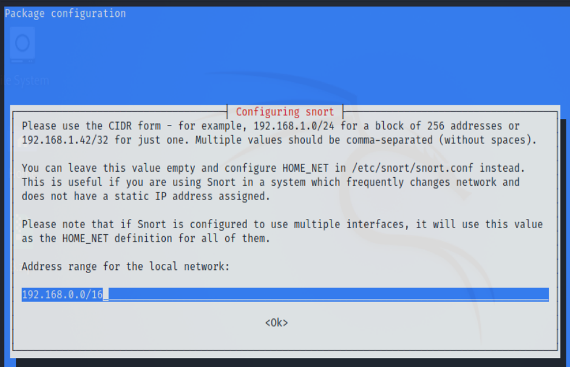

#### 解决方法：

配置`export DEBIAN_FRONTEND=noninteractive`要在root权限下配置，因为这相当于配置环境变量

## 实验参考

- [IDS vs. IPS: What is the Difference?](https://www.varonis.com/blog/ids-vs-ips/)
- [Writing Snort Rules](http://manual-snort-org.s3-website-us-east-1.amazonaws.com/node27.html)
- [CUCCS/2019-NS-Public-chencwx](https://github.com/CUCCS/2019-NS-Public-chencwx/blob/ns_chap0x09/ns_chapter9/入侵检测.md)
- [2020-ns-public-LyuLumos](https://github.com/CUCCS/2020-ns-public-LyuLumos)

